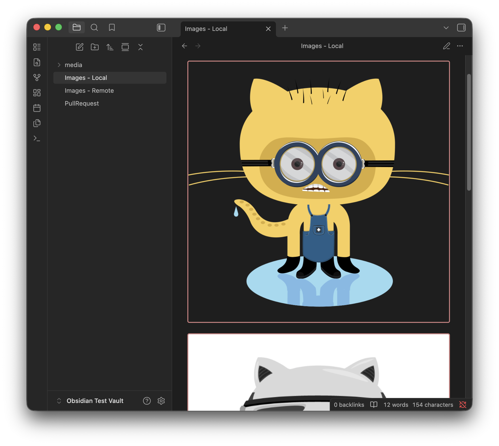

# Image Border Style (Obsidian Plugin)

With this plugin, you can:

Have nice rounded borders (or not) for images ranging from no-border, to a 2px border all the way to a 32px border radius.

And, tinker with more image border related settings.

Features:
- Lightweight, negligible impact on performance.
- Default border radius is same as one in Notion.
- 9 sizes from no-border to 4XL border radius.
- Ability to choose Border Width (6 sizes from 0px to 5px).
- Automatic Theme-Aware Border Color (faint grey for dark mode, and charcoal for light mode).
- Custom Border Color setting.

## Installing the plugin
Easiest way is to install it from the Obsidian Community Plugin marketplace (currently under review).

Until it's approved by the Obsidian team, the plugin will need to be installed manually.

## Manually installing the plugin
- Go the releases section and download `main.js`, `styles.css`, `manifest.json` from the latest release.
- Copy over `main.js`, `styles.css`, `manifest.json` to your vault `VaultFolder/.obsidian/plugins/image-border-style/`.

## Development
1. Clone the repository: `git clone https://github.com/shenoy-anurag/obsidian-image-border-style.git`.
2. Run `yarn install` to install dependencies.
3. Run `yarn run build` to build the plugin.
4. Run `./publish_plugin_local.sh` to copy the plugin files to your Obsidian Vault's plugin folder. [Learn how to do this in the Wiki](https://github.com/shenoy-anurag/obsidian-image-border-style/wiki/Local-Plugin-Testing-Script).

## Support me if you like this project!

